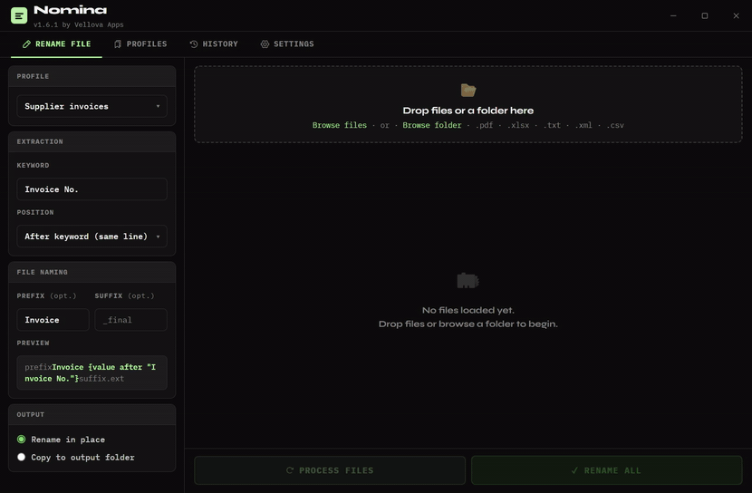
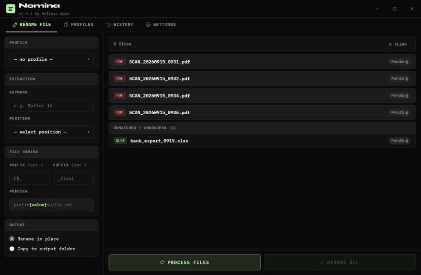
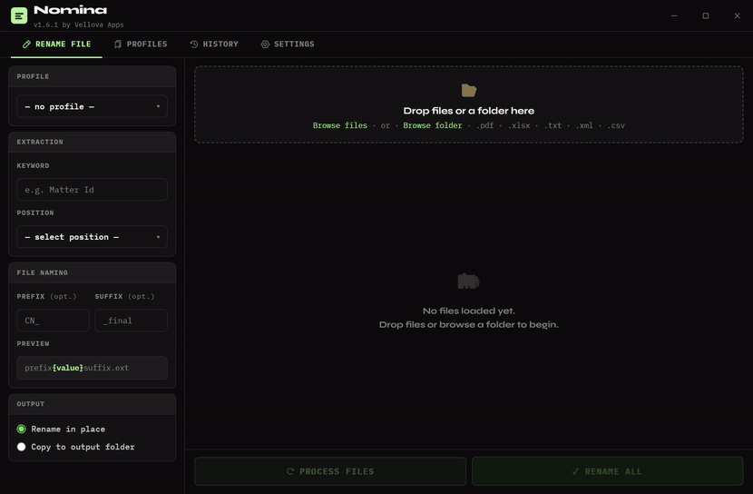

# Nomina

**Rename files automatically based on their PDF content.**

Nomina reads the text inside your PDF files and renames them according to patterns you define, with no manual work and no copy-pasting. Built for professionals who process large volumes of documents and need precision at scale.

> Part of the [Vellova Apps](https://github.com/vslnnd) suite · [See it on my portfolio](https://nenad.vercel.app/nomina/)

---

## Features

- Spatial text extraction that handles multi-column PDFs and complex layouts
- Anchor-based naming patterns with multi-match navigation
- Matching XLSX, TXT, XML and CSV files are paired with their PDF and renamed with it
- Batch processing with a live preview before any file is renamed
- Profiles for the patterns you use often
- Auto-updates that install in the background

---

## See it in action

### Pick files

Drop in a batch of scans. Each PDF is read, matching files are paired with it, and every new name is previewed before you rename.



### Rename options

Set a keyword and where the value sits relative to it, plus an optional prefix and suffix.


### Profiles

Save a renaming pattern as a profile and apply it in one click.



### History

A full log of every rename, batch by batch.



### Settings

Auto-updates install in the background, plus appearance and feedback.


---

## Download

Get the latest Windows installer from the [Releases](../../releases/latest) page. Run it, and Nomina keeps itself up to date from then on.

---

## For developers

```bash
npm install
npm start
```

---

*Built by [Nenad](https://github.com/vslnnd) · Vellova Apps*
