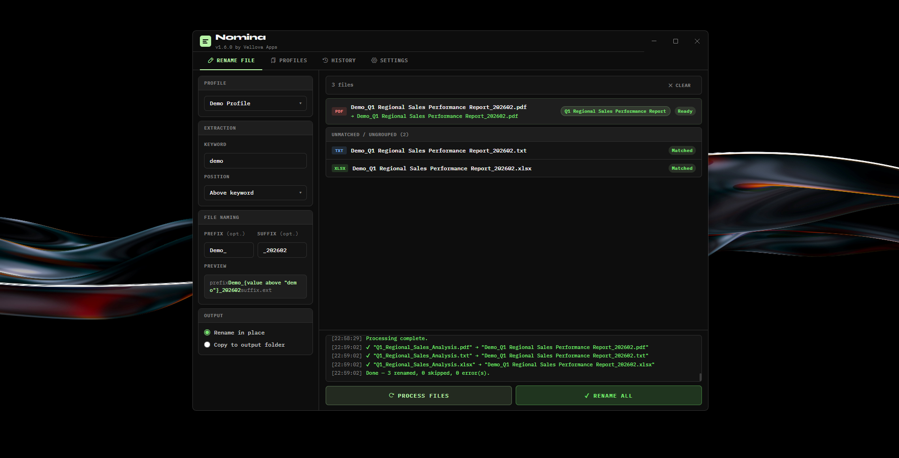
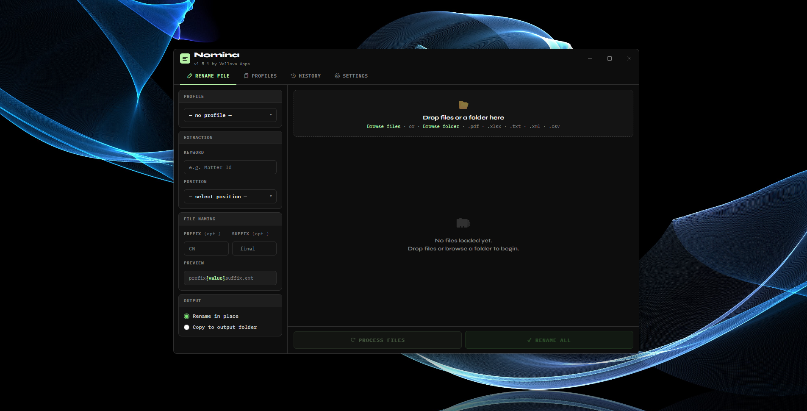
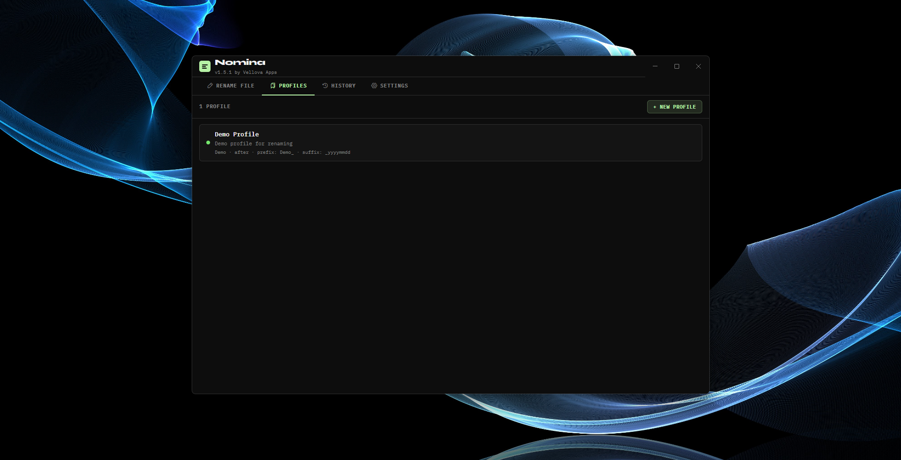
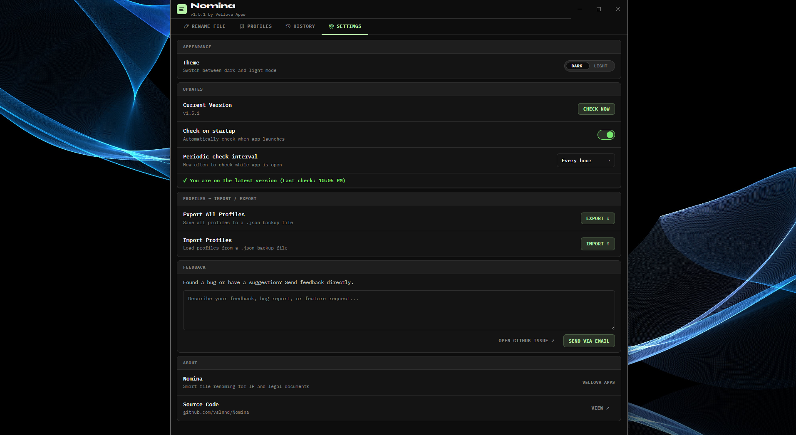

# Nomina

**Rename files automatically based on their PDF content.**

Nomina reads the text inside your PDF files and renames them according to patterns you define — no manual work, no copy-pasting. Built for professionals who process large volumes of documents and need precision at scale.

> Part of the [Vellova Apps](https://github.com/vslnnd) suite.

---

## Features

- Spatial text extraction — correctly handles multi-column PDFs and complex layouts
- Anchor-based naming patterns with multi-match navigation
- Batch processing with live preview before any files are renamed
- Auto-updates — new versions install silently in the background
- Windows support

---

## Screenshots

**Rename File — drop your files, set a keyword and position, preview the output before renaming**


**Empty state — clean starting point, supports PDF, XLSX, TXT, XML and CSV**


**Profiles — save your extraction configuration and reuse it across sessions**


**Settings — manage updates, import/export profiles, and send feedback directly**


---

## Download

Get the latest version from the [Releases](../../releases/latest) page.

| Platform | File |
|----------|------|
| Windows | `.exe` installer |

No setup required — download, install, open.

---

## For developers

```bash
npm install
npm run dev
```

---

*Built by [Nenad](https://github.com/vslnnd) · Vellova Apps*
